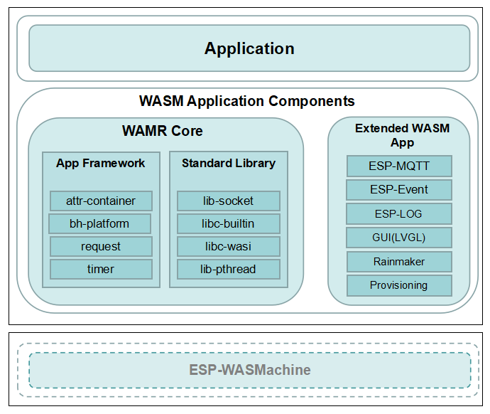

# Espressif IoT WebAssembly Application Development Framework (Preview)

* [中文版](./README_CN.md)

## 1. Introduction

ESP-WDF (WebAssembly Development Framework) is a WebAssembly application development Framework for IoT (Internet of Things) applications. For the corresponding WebAssembly VM (virtual machine) development framework, please refer to [README](https://github.com/espressif/esp-wasmachine/README_CN.md). The main components and architecture of software are as follows:

<div align="center"></div>

### 1.1 Directory

The main directory structure of ESP-WDF is as follows:

```
esp-wdf/
    ├──components
        ├──data_sequence            Data sequences used for parameter transfer between VM and APP
        ├──esp_common               Common component WASM adapter functions
        ├──esp_event                Event WASM adapter functions
        ├──extended_wasm_app
            ├──esp_http_client      ESP-HTTP-Client WASM adapter functions
            ├──esp_lvgl             LVGL WASM adapter functions
            ├──esp_mqtt             ESP-MQTT WASM adapter functions
            ├──esp_wifi             Wi-Fi header files
            ├──esp-rainmaker        ESP-RainMaker Cloud Service WASM adapter Function
            ├──wifi_provisioning    Wi-Fi Provisioning Provisioning WASM adapter Function
        ├──log                      ESP-Log WASM adapter functions
        ├──qrcode                   QR-Code WASM adapter functions
        ├──wamr
            ├──app-framework        Parts of the App-Framework components in WAMR
            ├──lib-socket           Socket WASM adapter functions
            ├──libc-builtin-extended    Libc extension functions
            ├──libc-builtin-sysroot     Libc header files
            ├──libc-wasi            Libc WASI header files
    ├──example                      Examples for evaluation and testing
    ├──tools                        Compiling scripts and tools
```

- **Note**: esp_common, esp_event, and log are compatible with ESP-IDF components.

## 2. Install Development Environment

The installation of the development environment for ESP-WDF is similar to that of ESP-IDF. Run the following command to automatically install the development environment:

- Linux or MacOS operating system

```
./install.sh
```

- Windows operating system

```
./install.bat
```

IF the development environment is installed successfully, the following log information appears:

```
All done! You can now run:

  . ./export.sh
```

## 3. Compile Project

We will indicate the compiling process by taking the compilation project [hello_world](./examples/hello_world) as an example. Please go to the esp-wdf root directory and configure the compilation environment by running the following command:

```
cd esp-wdf
. ./export.sh
```

Switch to the application project directory by running the following command:

```
cd examples/hello_world
```

Configure functions and parameters by running the following command. If you do not need to configure them, skip this step:

```
idf.py menuconfig
```

Execute the following command to compile the project:

```
idf.py build
```

If the project is compiled successfully, the following log appears:

```
[100%] Built target hello_world.wasm
Done
```

The generated firmware is `build/hello_world.wasm`.

About how to create your own project, please refer to the relevant [document](https://docs.espressif.com/projects/esp-idf/zh_CN/v4.4.2/esp32/api-guides/build-system.html#example-project-structure) of ESP-IDF.

## 4. Download and Run Application

There are two methods to download and run an application:

1. Store the compiled firmware in the file system and run the WebAssembly application by executing relevant commands. For the specific process, please refer to the relevant [document](https://github.com/espressif/esp-wasmachine/README_CN.md#4.4-Run WebAssembly Application) of ESP-WASMachine.

2. You can also use [tools/host_tool.py](./tools/host_tool.py) to remotely install and manage a WebAssembly application. The command format is following:

```
host_tool.py -i/-u/-q <app name> [Configuration parameters]

    -i: installs an application
    -u: uninstalls an application
    -q: Obtains the application information, or obtains all applications' information without `<app name>`
```

The relevant configuration parameters are described as follows:：

- general configuration parameters：

```
    --type: type of app
    --address/-S: Server IP address
    --port/-P: Server port
```

- installing configuration parameters：

```
    --file/-f: WebAssembly application file name with full path
    --heap: heap size of app, in bytes
    --timer: max timers number app can use
    --watchdog: watchdog interval in ms
```

## 5. Development Considerations

According to the underlying principles of WebAssembly, applications cannot access unauthorized resources, especially memory resources. Thus, there are some differences between WebAssembly applications and applications developed using C/C++. The differences are listed below.

### 5.1 Access Structure Member

If applications get structure pointers supplied by virtual machine, and access member variables in this structure directly, this operation will raise the following exception:

```
out of bounds memory access
```

This problem is susceptible to occur in the LVGL development. Thus, based on the original LVGL API, we add a suits of special APIs to allow the application access structure members. In addition, this method reduces the coding complexity. For details about the API, please refer to [esp_lvgl.h](./components/extended_wasm_app/esp_lvgl/include/esp_lvgl.h). The relevant examples are as follows:

#### 5.1.1 Example 1

```c
static timer_callback(lv_timer_t *timer)
{
    void *user_data = timer->user_data;

    ...
}
```

Modify to be:

```c
static timer_callback(lv_timer_t *timer)
{
    void *user_data = lv_timer_get_user_data(timer);

    ...
}
```

#### 5.1.2 Example 2

```c
static void init_menu(void)
{
    ...
    lv_obj_set_size(scene_bg, w, h - subtitle->coords.y2 - LV_DPI_DEF / 30);

    ...
}
```

Modify to be:

```c
static void init_menu(void)
{
    ...

    lv_area_t obj_area;
    lv_obj_get_data(subtitle, LV_OBJ_COORDS, &obj_area, sizeof(obj_area));

    lv_obj_set_size(scene_bg, w, h - obj_area.y2 - LV_DPI_DEF / 30);

    ...
}
```

### 5.2 Asynchronous Operation

Dynamic operation/installation of WebAssembly applications belongs to asynchronous operations. Thus, if the original module does not support asynchronous operations, related functions should be added. For example, the native LVGL does not support multithreading. In order to achieve dynamic operation/installation of the application, the `lock` related interface should be added. You can refer to the following steps to initialize the LVGL component asynchronously:

```c
lvgl_init();                # Initialize LVGL
lvgl_lock();                # Suspend LVGL scheduling
user_init_lvgl_menu();      # Configure the user menu
lvgl_unlock();              # Restore LVGL scheduling
```

From the above flow, we can see that you do not need to call functions like the following at the application level to drive the LVGL kernel:

```c
while(1) {
    lv_task_handler();
    sleep_ms(10);
}
```

## 6. Follow-up work arrangement

ESP-WDF is an attempt of WebAssembly technology on the ESP32 series chips. There are still unresolved problems worth exploring. We will address these problems in the coming days and add more rich and easy-to-use features. With this base release, our goal is to make it easier for users to develop WebAssembly applications.

If you have ideas or requirements that improve this SDK well, or if solving such problems makes you excited, we would like to talk to you for collaboration.
