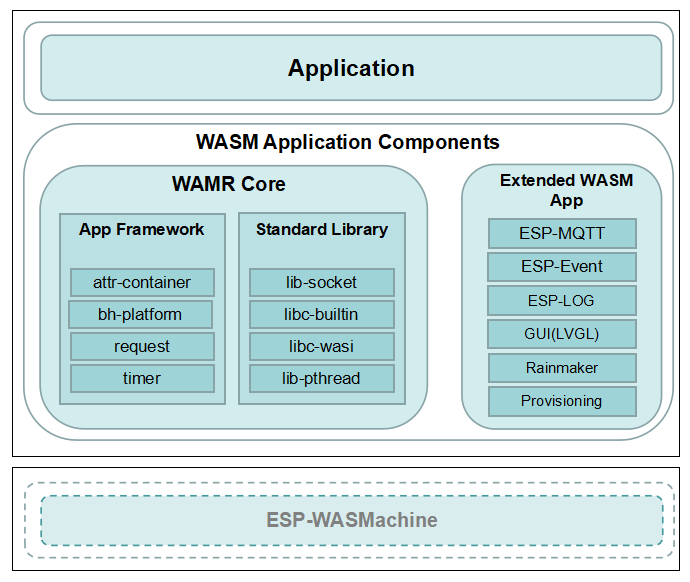

# Espressif 物联网 WebAssembly 应用程序开发框架（Preview）

* [English Version](./README.md)

## 1. 简介

ESP-WDF (WebAssembly Development Framework) 是面向物联网应用的 WebAssembly 应用程序开发框架，对应的 WebAssembly 虚拟机开发框架请参考 [README](https://github.com/espressif/esp-wasmachine/README_CN.md)。系统支持的主要功能模块和整体架构如下图所示：

<div align="center"></div>

### 1.1 目录

ESP-WDF 的主要目录结构如下：

```
esp-wdf/
    ├──components
        ├──data_sequence                数据序列，用于虚拟机和应用之间的参数传递
        ├──esp_common                   公共模块 WASM 适配函数
        ├──esp_event                    Event WASM 适配函数
        ├──extended_wasm_app              
            ├──esp_http_client          ESP-HTTP-Client WASM 适配函数
            ├──esp_lvgl                 LVGL WASM 适配函数
            ├──esp_mqtt                 ESP-MQTT WASM 适配函数
            ├──esp_wifi                 Wi-Fi 头文件定义
            ├──esp-rainmaker            ESP-RainMaker 云服务 WASM 适配函数
            ├──wifi_provisioning        Wi-Fi Provisioning 配网服务 WASM 适配函数
        ├──log                          ESP-LOG WASM 适配函数
        ├──qrcode                       QR-Code WASM 适配函数
        ├──wamr
            ├──app-framework            WAMR 中部分 app-framework 组件
            ├──lib-socket               socket WASM 适配函数
            ├──libc-builtin-extended    libc 扩展函数
            ├──libc-wasi                libc WASI 头文件定义
    ├──example                          用于评估和测试的示例程序
    ├──tools                            编译相关的脚本和工具
```

- **注意**：esp_common, esp_event 和 log 等兼容 ESP-IDF 对应组件

## 2. 安装开发环境

ESP-WDF 的开发环境安装方法和 ESP-IDF 类似。通过运行以下指令，可以自动完成安装：

- Linux 或 MacOS 操作系统

```
    ./install.sh
```

- Windows 操作系统

```
    ./install.bat
```

安装成功之后会显示如下 log：

```
All done! You can now run:

  . ./export.sh
```

如需编译 AOT 格式的固件，需要自己构建 `wamrc` 工具，具体操作步骤可以参考[文档](https://github.com/bytecodealliance/wasm-micro-runtime/blob/main/wamr-compiler/README.md). 

## 3. 编译项目

下面，我们以编译工程 [hello_world](./examples/hello_world) 为例进行说明。运行以下命令切换到 esp-wdf 根目录来配置编译环境：

```
cd esp-wdf
. ./export.sh
```

运行以下命令以切换到项目目录：

```
cd examples/hello_world
```

运行以下命令来配置功能和参数。如果您不需要进行配置，可以跳过该步骤：

```
idf.py menuconfig
```

## 3.1 WASM 固件

运行以下命令编译工程：

```
idf.py build
```

编译完成之后会显示如下的 log 信息：

```
[100%] Built target hello_world.wasm
Done
```

编译生成的固件为 `build/hello_world.wasm`。

## 3.2 AOT 固件

运行以下命令编译工程：

```
idf.py build aot
```

编译完成之后会显示如下的 log 信息：

```
Compile success, file hello_world.aot was generated.
Done
```

编译生成的固件为 `build/hello_world.aot`。

关于如何创建自己的项目，可以参考相关的 ESP-IDF [文档](https://docs.espressif.com/projects/esp-idf/zh_CN/v4.4.2/esp32/api-guides/build-system.html#example-project-structure)。

## 4. 下载及运行应用程序

有两种方法可以下载、运行应用程序：

1. 把编译的固件存储到文件系统中，执行相关的命令运行该 WebAssembly 应用程序，具体流程请参考 ESP-WASMachine 中的[说明](https://github.com/espressif/esp-wasmachine/README_CN.md#4.4-运行 WebAssembly 应用程序)

2. 通过 [tools/host_tool.py](./tools/host_tool.py) 软件远程安装/管理 WebAssembly 应用程序，相关命令如下：

```
host_tool.py -i/-u/-q <app name> [配置参数]

    -i: 安装应用程序
    -u: 卸载应用程序
    -q: 获取应用程序信息，如果不带 <app name> 则获取所有 app 的信息
```

配置参数说明如下：

- 通用参数：

```
    --type：WebAssembly 应用程序类型
    --address/-S：服务器的 IP 地址
    --port/-P：服务器的端口号
```

- 安装 WebAssembly 应用程序的参数：

```
    --file/-f：带路径的 WebAssembly 应用程序名
    --heap：WebAssembly 应用程序堆空间大小
    --timer：WebAssembly 应用程序可以使用的 timer 数量
    --watchdog：WebAssembly 应用程序看门狗间隔，单位是毫秒
```

## 5. 开发注意事项

根据 WebAssembly 的实现原理，应用程序无法访问未被授权的资源，尤其是内存资源，所以 WebAssembly 应用程序和使用 C/C++ 开发的普通应用程序有一些不同之处，主要包括以下几点：

### 5.1 访问结构体成员

如果 WebAssembly 应用程序使用的结构指针是由虚拟机分配的，那么直接访问该结构体中的成员变量会触发以下异常：

```
out of bounds memory access
```

这个问题在 LVGL 开发中比较容易出现，为此我们在原有的 LVGL API 基础上新增了特殊的 API 使得应用能够访问结构体成员，以减少代码的复杂度。相关的 API 请参考 [esp_lvgl](./components/extended_wasm_app/esp_lvgl/include/esp_lvgl.h)，参考示例如下：

#### 5.1.1 示例 1

```c
static timer_callback(lv_timer_t *timer)
{
    void *user_data = timer->user_data;

    ...
}
```

修改为：

```c
static timer_callback(lv_timer_t *timer)
{
    void *user_data = lv_timer_get_user_data(timer);

    ...
}
```

#### 5.1.2 示例 2

```c
static void init_menu(void)
{
    ...
    lv_obj_set_size(scene_bg, w, h - subtitle->coords.y2 - LV_DPI_DEF / 30);

    ...
}
```

修改为：

```c
static void init_menu(void)
{
    ...

    lv_area_t obj_area;
    lv_obj_get_data(subtitle, LV_OBJ_COORDS, &obj_area, sizeof(obj_area));

    lv_obj_set_size(scene_bg, w, h - obj_area.y2 - LV_DPI_DEF / 30);

    ...
}
```

### 5.2 异步操作

动态运行/安装 WebAssembly 应用程序，属于异步操作。因此，如果使用的模块不支持异步操作，就需要增加相关的功能。例如，原生的 LVGL 不支持多线程，所以为了实现应用程序的动态运行/安装，我们新增了 `lock` 相关的接口，以异步初始化 LVGL 组件，其流程如下：

```c
lvgl_init();                # 初始化 LVGL
lvgl_lock();                # 暂停 LVGL 调度
user_init_lvgl_menu();      # 配置用户菜单
lvgl_unlock();              # 恢复 LVGL 调度
```

从上面的流程可以看出，您无需在应用层调用类似如下的函数来驱动 LVGL 内核：

```c
while(1) {
    lv_task_handler();
    sleep_ms(10);
};
```

## 6. 后续工作安排

ESP-WDF 是 WebAssembly 技术在 ESP32 系列芯片上的尝试，当前还有一些问题尚未解决，我们会尽力解决这些问题，并添加更多的丰富易用的功能。通过此基础版本，我们的目标是帮助您更加方便地开发 WebAssembly 虚拟机程序、添加新的扩展和部署应用程序。

如果您有基于此框架的想法或需求，或者有兴趣探索此类问题，欢迎您与我们进行沟通。